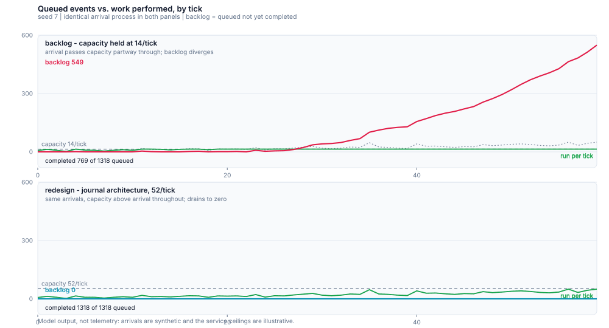

# Capacity and cost patterns for CI at agentic-coding scale

Reference patterns, plus small **offline simulations**, for keeping CI throughput and
cost predictable when the number of pull requests and tests grows faster than the
number of engineers.

Everything in this repository runs locally with nothing but a Python 3 standard
library interpreter. No cloud calls, no credentials, no network, no real runner
registration. The simulations are *models*: they exist to make queueing, selection,
and runner-lifetime behaviour reproducible and inspectable, not to measure a real
installation.

```console
$ python3 examples/selector_demo.py --help
$ python3 tests/run_all.py
```

---

## 1. Status: what is implemented, what is simulated, what is only proposed

This repository contains offline models, not a runner installer. The separate
CircleCI hosted ARM64 pilot and the cited production designs have different
evidence levels:

| Status | Meaning | Where it lives |
| --- | --- | --- |
| **Runnable here** | Deterministic simulations and tests requiring only Python 3. | `examples/`, `tests/` |
| **Observed separately** | A private project's opt-in CircleCI `arm.medium` conformance subset passed (125 tests); no self-hosted CircleCI runner was installed. This did not replace mandatory checks or measure queue reduction. | [Sourced findings](docs/SOURCES.md#3-what-we-verified-ourselves-and-what-we-did-not) |
| **Source-reported** | Anthropic's selector architecture and `related-sciences/gce-github-runner` are their implementations, not code deployed here. | [Sourced findings](docs/SOURCES.md) |
| **Proposed / design only** | Migrating further CI gates, admission of new execution pools, and measuring a real queue reduction require separate review and evidence. | README §4–§5 |

No registered self-hosted runner, cloud worker, or production controller is
included in this public repository. Its capacity numbers are model output.

---

## 1a. Our CI decisions, as a case study

The patterns above are general. This is what one private project actually runs,
stated narrowly and only where we can stand behind the claim. Aggregate facts
only — no identifiers, hostnames, credentials, or private repository names.

### The shape we run

The private repository uses **two GitHub self-hosted ARM64 controllers**. A
**thin controller action** performs no build work: it provisions a **disposable
sandbox** (a rented cloud instance), runs the job there, and tears it down
afterwards. The controller action is passed provider and GitHub tokens through
its environment for that purpose.

**Three shared-label conformance jobs** can run on either controller — the shared
label is the routing contract from §4.1, and reuse is deliberate.

Independently, **four jobs are pinned to one controller**: three by acceptance/
intake policy, and **migration apply**, which needs Docker/buildx and PostgreSQL
on the runner itself. That is the specific reason migration apply cannot simply
be moved into the sandbox — it cannot run there without Docker.

The controller also **waits synchronously on the sandbox** for the duration of
the job (see below).

Separately, a **hosted CircleCI `arm.medium`** path exists as a **test pilot**,
not a production replacement — it does not "cover" the production ARM64
workload. It is opt-in behind a parameter that can be enabled on any branch. The
run that used it passed **125 tests**, proving that subset on hosted ARM64 and
nothing more.

### The bottleneck we have not solved

The controller **occupies its runner synchronously for the full duration of the
sandbox job**. While the sandbox runs, the runner orchestrating it is
unavailable for anything else. With two controllers, this is the constraint that
bounds throughput, and it is not fixed.

Note that this is a *different* problem from the one in §2. Anthropic's was a
single-writer service whose in-process state blocked horizontal sharding, solved
by moving state out of the process. This one is synchronous occupancy in the
controller-to-sandbox handoff. We are not claiming equivalence, and we are not
claiming it is resolved.

### What we measured

One historical observation from an **older controller**, which occupied its
runner for about **1209 s** for a job while a short sibling waited about
**1516 s** behind it. Both are aggregate durations from that earlier design.

**We do not claim this was resolved, and we have not measured a queue
improvement.** No before/after comparison exists. Anyone reading a number in
this repository should treat it as model output or as a labelled historical
observation — never as evidence that a change made anything faster.

### Verified, unverified, and deliberately unclaimed

**Verified:** the private project's CI runs on two GitHub self-hosted ARM64
controllers; the shared-label and pinned-job routing described above; the
125-test run passed on hosted CircleCI `arm.medium`, proving that subset only;
the historical durations above.

**Not verified:** no self-hosted CircleCI runner was installed, so nothing about
self-hosted runner admission or registration is claimed. We also make no
security claims about what the sandbox can reach or hold: the controller action
receives provider and GitHub tokens through its environment, and we have not
established what propagates further. That distinction is left open rather than
asserted.

One distinction worth keeping sharp: a *shared label* in a **public compute
fabric** describes which Node Slot a workload may run on. The fabric's
verified/not-admitted state is a statement about *fabric scheduling*. It is not
a CI runner registration, and it grants nothing on GitHub or CircleCI. Keeping
those two senses of "label" separate is what stops a capacity discussion from
quietly becoming an authorization one.

---

## 2. The problem shape

The pressure is not "tests are slow". It is that the *slope* changed. When agents
write and review code, both the number of pull requests and the number of tests
grow at once, while the engineering headcount does not.

Anthropic published a concrete account of this: CI job volume grew **25x over six
months** and the number of tests grew **10x**, with only a nominal increase in
engineers. Their test-selection service, built as a single process, was patched
three times — a bigger machine (bought 70 days), per-package sharding (bought 29
days), then daily restarts (bought less than a day) — before being redesigned
around an in-memory data store with stateless listener workers, a journal, and a
separate consumer that rolls the journal up into per-test history.
See <https://claude.com/blog/agentic-coding-is-straining-ci-heres-how-we-scaled-test-impact-analysis-at-anthropic>.

Two lessons from that account drive everything in this repository:

1. **Queue depth is the leading indicator.** While a listener falls behind, the
   selector is deciding from stale data. The visible symptom is *not* a red build;
   it is CI running the wrong set of tests while looking healthy.
2. **Plan for the exponential.** The article's own recommendation is to assume
   your architecture will be at **25x load within two quarters**. That reframes
   "over-engineering" — a design that is comfortable at today's load but has no
   horizontal axis is already late.

A third lesson is structural and is the one most often skipped. The service
depended on two components staying in sync: a **listener** that records every test
result, and a **selector** that reads that history to decide what runs. A single
writer made history consistent but made the system impossible to shard. Moving
state out of the process is what created the horizontal axis.

---

## 3. Runnable simulations

All three scripts accept `--help` and print a human-readable report to stdout by
default. Passing `--json` prints the machine-readable report instead, and passing
`--report-dir DIR` additionally writes `<name>_report.txt` and
`<name>_report.json` into `DIR` (nothing is written otherwise). The two traffic
simulations take `--seed` for byte-identical repeat runs; the selector is
deterministic for the same graph, history, and changed files.

### 3.1 `queue_vs_run.py` — queue depth vs. work performed

Models a listener/selector service under a bursty arrival process with a fixed
per-tick service ceiling, and reports both **queued** (accepted) and **run**
(actually completed) work. Completed work in any tick is capped at
`service_rate × workers`; there is exactly one completion path, and the model
asserts conservation of work (`run_total + backlog == queued_total`) on every run.

```console
$ python3 examples/queue_vs_run.py --scenario backlog --seed 7
$ python3 examples/queue_vs_run.py --scenario redesign --seed 7
$ python3 examples/queue_vs_run.py --compare --seed 7
```

`backlog` and `redesign` share an identical arrival process (8/tick growing 3%
per tick, with periodic bursts); they differ only in *capacity*. `backlog` holds
at 14 per tick, which arrival passes partway through, so its backlog diverges.
`redesign` has 52 per tick — capacity the journal architecture earns by making
workers horizontally scalable, not extra service per tick for free — and drains
to zero. The same arrivals yield more completed work in `redesign`; backlog
shows how much work remains unprocessed and whether the queue is diverging.



The two panels are the same seeded model output, not an illustration: identical
arrivals, different service ceilings.

### 3.2 `label_lifetime.py` — ephemeral labels and runner lifetime

Simulates job arrival against a pool of ephemeral runners described by
`(labels, capacity)` and a lifetime policy, and accounts for every runner with an
explicit end state.

```console
$ python3 examples/label_lifetime.py --scenario steady --seed 7
$ python3 examples/label_lifetime.py --scenario burst --seed 7
$ python3 examples/label_lifetime.py --scenario fault-injection --seed 7
$ python3 examples/label_lifetime.py --scenario unsafe-admission --seed 7
```

The last two are the instructive ones. `fault-injection` fails a provisioning
attempt every fifth runner and asserts that the failure surfaces as an error
rather than a silent success. `unsafe-admission` attempts to send untrusted fork
pull-request code to a self-hosted pool — and the simulator **refuses to
construct it**, exiting non-zero with the reason. That refusal is the safety rule
of §5.1 expressed as executable configuration rather than as prose.

Exit status is non-zero for a *fault*. It is zero for a *saturated* pool that
respected every lifecycle invariant, because congestion is the finding you asked
for, not a failure. Conflating the two would train you to ignore the signal.

Invariants asserted (and defended by `tests/`): **no job is assigned to a runner
that is already busy**, **no ephemeral runner serves more than one job**, every
**ephemeral** runner reaches a terminal state (persistent runners are instead
accounted as still-live and reusable at the end of a run), the number of runners
alive at once never exceeds the pool's limit, and the pool is reconciled once
after work drains — not every tick, which would destroy the pre-warmed pool
before any job could reach it.

### 3.3 `selector_demo.py` — impact selection with a stale-history guard

The substantive one. A dependency graph maps source packages to test suites; a
history file records known pass/fail outcomes per suite. Given a changed file set,
the demo computes the selected suites — and, critically, defines what it does when
the history is stale, incomplete, or missing.

```console
$ python3 examples/selector_demo.py --changed api/handlers.py
$ python3 examples/selector_demo.py --changed packages/db/schema.sql \
      --history examples/fixtures/history_stale.json
$ python3 examples/selector_demo.py --changed nowhere/at/all.rs --json
```

Three rules encode the conservative posture:

- **Map, don't guess.** A changed file that maps to no known suite selects the
  *full* suite, never an empty set. An empty selection from an unmapped file is
  the classic silent-skip bug: the pipeline goes green because nothing ran.
- **Stale widens to full.** If any *impacted* suite has history older than the
  configured freshness window — or none at all — the selection is widened to
  the entire known suite set (`full_suite_forced: true`), and the reason is
  reported. Merely relabelling the affected suite would leave the selected set
  identical to the fresh case, changing nothing a caller could observe.
- **Unknown is not empty.** A history file that cannot be parsed, or a suite with
  no entry at all, is reported as degraded or as an error — never read as "no
  known failures, therefore nothing to run."

---

Open [`docs/diagrams/ci-capacity.architecture.html`](docs/diagrams/ci-capacity.architecture.html)
for an interactive diagram of the listener/selector architecture described in
Anthropic's article ([source](https://claude.com/blog/agentic-coding-is-straining-ci-heres-how-we-scaled-test-impact-analysis-at-anthropic)) —
pan, zoom, search, and relationship tracing. It is generated from the editable
specification at
[`docs/diagrams/ci-capacity.architecture.json`](docs/diagrams/ci-capacity.architecture.json).
The service depicted is Anthropic's; this repository implements no part of it,
and the diagram cites no local file as evidence for that architecture.

---

## 4. Runner capacity: hosted, self-hosted, ephemeral

| Approach | What it is | Where it is strong | Where it hurts |
| --- | --- | --- | --- |
| **Provider-hosted, per-minute** | The CI provider runs your job on its own managed compute and bills per minute. CircleCI's ARM resource classes (`arm.medium`, `arm.large`) are a hosted option. | Zero fleet ownership. Instant scale. ARM without owning ARM metal. | Cost scales linearly-ish with the *number* of jobs, which is the axis that just went exponential. |
| **Persistent self-hosted** | You register a long-lived machine as a runner. | Cheapest per minute; can sit inside a private network. | GitHub explicitly recommends **against** autoscaling persistent runners: it "cannot guarantee that jobs are not assigned to persistent runners while they are shut down". State leaks between jobs. |
| **Ephemeral self-hosted** | One job per runner, then de-register and destroy. | Clean environment per job; contains a compromised runner; the only shape GitHub recommends for autoscaling. | You now own provisioning latency, logging, and a drain story. |
| **Ephemeral on Kubernetes** | Container runner (CircleCI) or Actions Runner Controller (GitHub). Pods scale with demand; CircleCI tears pods down after each job. | Elastic capacity without operating VMs. | Requires a cluster plus the expertise to run it. Arc and CircleCI's container runner solve overlapping problems. |
| **Ephemeral VMs on Kubernetes** | CircleCI's Machine Runner Orchestrator uses KubeVirt to give each job a full VM with a configurable pre-warmed pool. | Stronger isolation than a shared container; a full OS when the job needs one. | Slowest cold path; heaviest operator burden. |

The decisive question is rarely "which is fastest". It is **where the trust
boundary sits relative to the code being executed** — see §5.

### 4.1 The label is the routing contract

CircleCI models this explicitly: a self-hosted runner needs both a **namespace**
(one immutable namespace per organization) and a **resource class**, which is "a
label to match your CircleCI job with a type of runner that is identified to
process that job". The job side is a `resource_class` key, and the same key is
also how you select a hosted execution environment (`arm.medium`, `arm.large`).
GitHub expresses the same idea with `runs-on` labels, and specifies the matching
rules precisely: an **online and idle** runner matching the labels and groups is
assigned the job; if it does not pick the job up **within 60 seconds** the job is
re-queued; and a job left queued past **24 hours** fails.

Those two numbers are why the lifetime simulation exists. "Label mismatch" in a
real fleet does not look like an error — it looks like a job that sits in a queue
until it times out a day later. A capacity model that only counts CPUs will miss
it entirely.

### 4.2 Pools that have to be reconciled

Whether you run ARC, CircleCI's container runner, or Machine Runner Orchestrator,
something is continuously comparing *desired* to *actual* and creating or
destroying runners. CircleCI's Machine Runner Orchestrator is described as
polling the CircleCI API for pending and running tasks, then adjusting a
`VirtualMachinePool` replica count to match demand, with a configurable
`minReplicas` keeping a pre-warmed pool. That pre-warmed pool is a direct
latency-for-money trade: idle VMs are the cost of never paying a cold boot.

---

## 5. Deploy safety: the rules this repository follows

These are not stylistic preferences. Getting them wrong is how a CI capacity
project becomes a security incident.

### 5.1 No self-hosted runners on untrusted fork pull requests

**This is the single most important rule here, and it applies to this public
repository specifically.** CircleCI's documentation states that self-hosted
runners are **Not Available** for public projects with the *Build forked pull
requests* setting enabled, "for security reasons: a malicious actor may alter
your machine or execute code on it by forking your repository, committing code,
and opening a pull request." GitHub's guidance points the same way: it recommends
using self-hosted runners **only with private repositories**, because forks of a
repository can run dangerous code on the runner through a pull request.

Consequences for a public repository like this one:

- **There is no self-hosted-runner workflow in this repository, and there must not
  be one.** Adding a workflow that runs on a self-hosted label, in a repository
  that accepts fork pull requests, is a remote-code-execution path into whatever
  infrastructure you attach to that label.
- If you need self-hosted capacity for a project that also accepts outside
  contributions, split the trust domains: run untrusted pull-request jobs on
  hosted, ephemeral, credential-free compute; run self-hosted work only on code
  you already trust (a `push` to a protected branch, a tagged release, or work
  gated behind a manual approval).
- Treat the runner's *whole environment* as the blast radius: the machine, its
  network position, its cloud identity, and anything persisted on it between
  jobs. Ephemeral runners bound this; persistent ones do not.

### 5.2 Cache is a trust boundary too

Cache poisoning is the sibling problem, and GitHub documents it directly: runs
triggered by `push`, `workflow_dispatch`, `repository_dispatch`, and a few other
trusted events may create or overwrite caches in the default branch's scope,
while runs triggered by events whose initiating actor can be influenced from
outside — `pull_request_target`, `issue_comment`, `workflow_run` — get
**read-only** access by default. Explicitly declaring `cache-mode: write` on a
low-trust trigger reintroduces the poisoning risk the default exists to prevent.
For a public repository, a pull-request run's cache is scoped to the merge ref
and cannot be restored by the base branch, which is a containment property worth
keeping.

### 5.3 Cost controls that are also safety controls

- Keep untrusted jobs free of long-lived cloud credentials; prefer short-lived,
  job-scoped identity.
- Enforce trust domains with repository access, runner groups (where available),
  and trusted workflow admission. Labels or resource classes route jobs; they
  do not authorize execution. See [GitHub runner groups](https://docs.github.com/en/actions/concepts/runners/runner-groups)
  and [runner selection](https://docs.github.com/en/actions/how-tos/write-workflows/choose-where-workflows-run/choose-the-runner-for-a-job).
- Prefer ephemeral runners so that "what was on the machine before" is not a
  question you have to answer after an incident.
- Bound the blast radius deliberately: separate networks, separate identities,
  separate credentials per pool.

---

## 6. How to read the numbers this repository produces

The examples emit numbers. Those numbers are **not** measurements of your system
or of anyone else's.

- The arrival process is synthetic and fixed by `--seed`. It is a *shape*, not a
  forecast.
- The dependency graph and history files are small, readable fixtures. They are
  there so the selection rules are auditable, not so the timings are meaningful.
- The runner pool definitions are illustrative configurations.

What *is* intended to generalise is the **invariant set**: no double-allocated
runner, no ephemeral runner reused, no silently-empty test selection, no stale
history treated as fresh, and an infrastructure error that never reports success.
Those hold regardless of the numbers you feed in, and `tests/` exists to prove
they fail when the code is broken rather than merely to observe that the code
runs.

---

## 7. Repository layout

```
examples/
  queue_vs_run.py        backlog/queueing model: queued vs run
  label_lifetime.py      ephemeral runner lifecycle + label routing
  selector_demo.py       test impact selection + fail-closed staleness guard
  queue_trajectory_svg.py  renders docs/diagrams/queue-trajectory.svg from the model
  cisim/                 shared library: seeded RNG, statistics, error vocabulary
    queue.py               arrival/service/backlog model
    lifetime.py            runner lifecycle, label routing, pool reconciliation
    selector.py            dependency-graph selection and the staleness policy
  fixtures/              dependency graph, history fixtures, pool definitions
tests/
  test_selection.py      selection correctness and staleness invariants
  test_lifetime.py       runner lifecycle and label-routing invariants
  test_reporting.py      infra/error paths never report success
  run_all.py             single entry point for the above
docs/
  SOURCES.md             sourced findings note, with provenance per claim
  diagrams/
    ci-capacity.architecture.json   interactive architecture diagram (Archify spec)
    ci-capacity.architecture.html   rendered interactive diagram; open in a browser
    queue-trajectory.svg            simulated backlog trajectories, both scenarios
```

`tests/run_all.py` is the only test entry point and it uses `unittest` discovery,
so it needs no third-party packages.

---

## 8. Sources

Full citations, with the specific claim each one supports, are in
[`docs/SOURCES.md`](docs/SOURCES.md). The short version:

- Anthropic, *Agentic coding is straining CI* — the 25x/10x growth figures, the
  listener/selector split, the three patches and their durations, the journal
  redesign, and the 25x-in-two-quarters planning guidance.
- CircleCI — self-hosted runner overview (container runner, machine runner,
  Machine Runner Orchestrator), runner concepts (namespaces, resource classes,
  the public-repository restriction), and resource class overview (hosted ARM
  classes).
- GitHub — self-hosted runner reference (routing precedence, the 60-second
  re-queue, the 24-hour queue timeout, ephemeral runners, ARC), self-hosted
  runner concepts (recommendation to use self-hosted runners with private
  repositories only), and dependency caching (cache scoping, low-trust trigger
  restrictions, cache poisoning).
- `related-sciences/gce-github-runner` (Apache-2.0) — cited as an **architecture
  reference only** for the pattern of creating an ephemeral VM in a setup job and
  passing its generated label as an output to downstream jobs. No code from that
  project is copied into this repository; it is not affiliated with this work and
  no part of it is reproduced here.

## License

MIT for the contents of this repository. Third-party projects referenced above
retain their own licenses.
